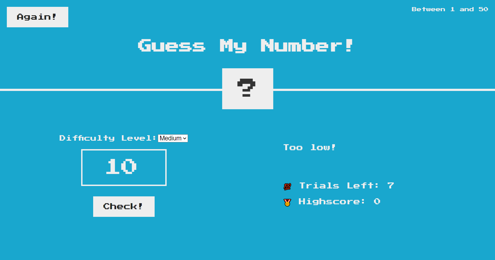

# Guess My Number

Guess My Number is a simple game where the player has to guess a secret number between 1 and 20. The game provides feedback to the player on whether their guess is too high or too low, and the player has 20 attempts to guess the correct number.

## Built With

This project was built using JavaScript, HTML, and CSS.

## Getting Started

To get started with the project, clone the repository to your local machine and open the `index.html` file in your browser.

## How to Play

1. Enter a number between 1 and 20 in the input field.
2. You can choose the difficulty level by seelecting dropdown menu and choosing the level which will determine the number of attempts you have to guess the correct number and the range of numbers you can guess from.
3. Click the "Check" button.
4. If your guess is correct, you win! Otherwise, try again and the game will tell you whether your guess was too high or too low.
5. You can play the game as many times as you want by clicking the "Again" button.

## Credits

This game was implemented as part of the "Complete JavaScript Course" by Jonas Schmedtmann on Udemy.

## Future Improvements

- [x] Add difficulty levels
- [ ] Add a timer
- [ ] Add multiplayer mode
- [ ] Add sound effects
- [ ] Add a leaderboard
- [ ] Add hints
- [ ] Add animations
- [ ] Add power-ups
