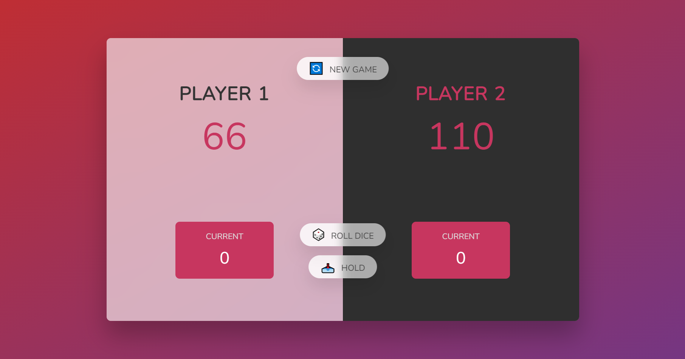

# Pig Dice Game

A simple two-player game where players take turns rolling dice and trying to reach a score of 100 to win.

## How to Play

1. Roll the dice by clicking the "Roll Dice" button. The number on the dice will be added to your current score.
2. You can keep rolling the dice and adding to your score as many times as you want.
3. If you roll a 1, your current score will be reset to 0 and your turn will end.
4. Click the "Hold" button to add your current score to your total score and end your turn.
5. The first player to reach a score of 100 or more wins!

## Technologies Used

- HTML
- CSS
- JavaScript

## How to Run

1. Clone this repository to your local machine.
2. Open the `index.html` file in your web browser.

## Screenshots

## Acknowledgments

- This project is based on a challenge from the [Complete JavaScript Course 2021: From Zero to Expert!](https://www.udemy.com/course/the-complete-javascript-course/) on Udemy.
